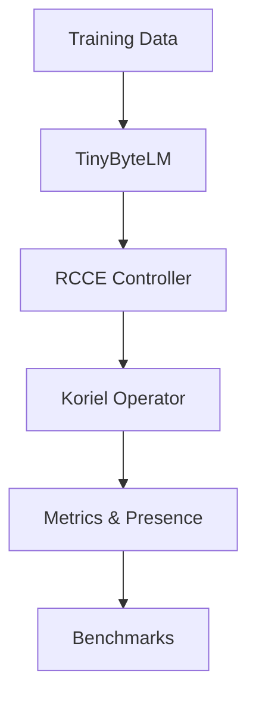

# Koriel-ASI — RCCE Phase-2 (CPU-only)

Koriel-ASI explores **Recursive Contextual Consciousness Engines (RCCE)** built on a
byte-level language model controlled by the Koriel operator. The project provides
training, evaluation and benchmarking tools for researching symbolic reasoning and
"presence" detection.

## Project goals
* Demonstrate a compact byte-level transformer (ByteLM) controlled by an ethics‑aware
  RCCE controller.
* Provide reference benchmarks for consciousness and reasoning evaluation.
* Offer reproducible training and evaluation pipelines that run on CPU‑only systems.

## Architecture



## Usage examples

### Linux / macOS
```bash
python3 -m venv .venv
source .venv/bin/activate
pip install -r requirements.txt
python src/train.py  # run a training session
python -m pytest     # run tests
```

### Windows (PowerShell)
```powershell
Set-ExecutionPolicy -Scope Process Bypass
./scripts/setup.ps1
./scripts/run_tests.ps1
```